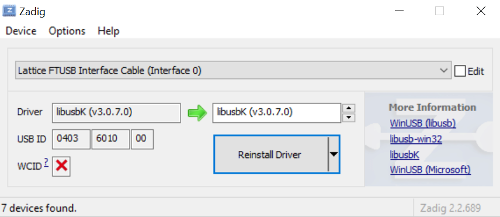

.. _quickstart:drivers:

Install/configure the drivers
-----------------------------

On Windows, an external application (`Zadig <https://zadig.akeo.ie/>`_) is used for boards with FTDI devices.
It replaces the existing FTDI driver of the **Interface 0** with **libusbK**.

On macOS, this operation requires internet connection to allow *Homebrew* to install ``libffi`` and ``libftdi`` packages.
